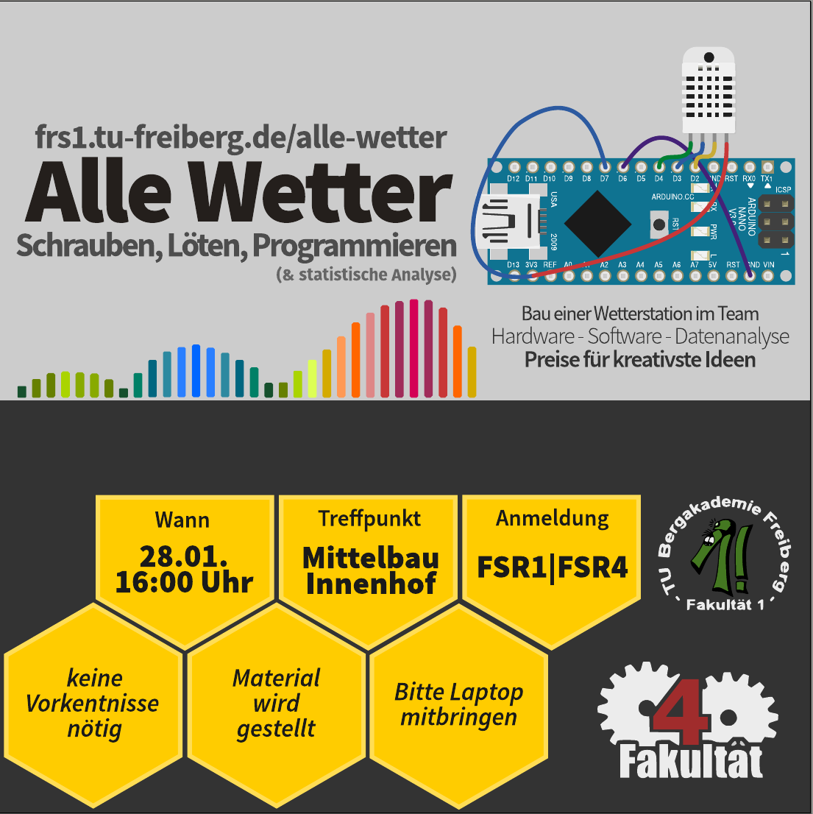
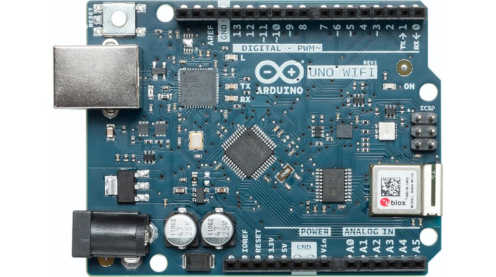
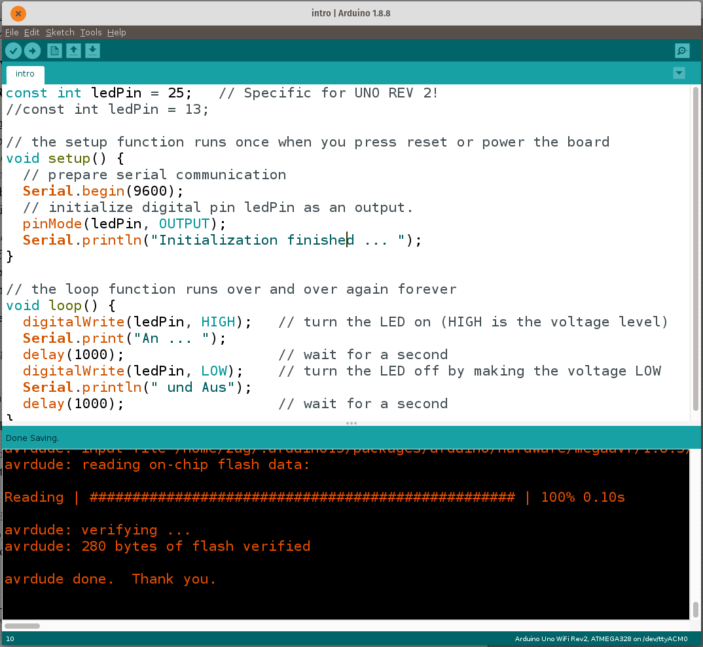
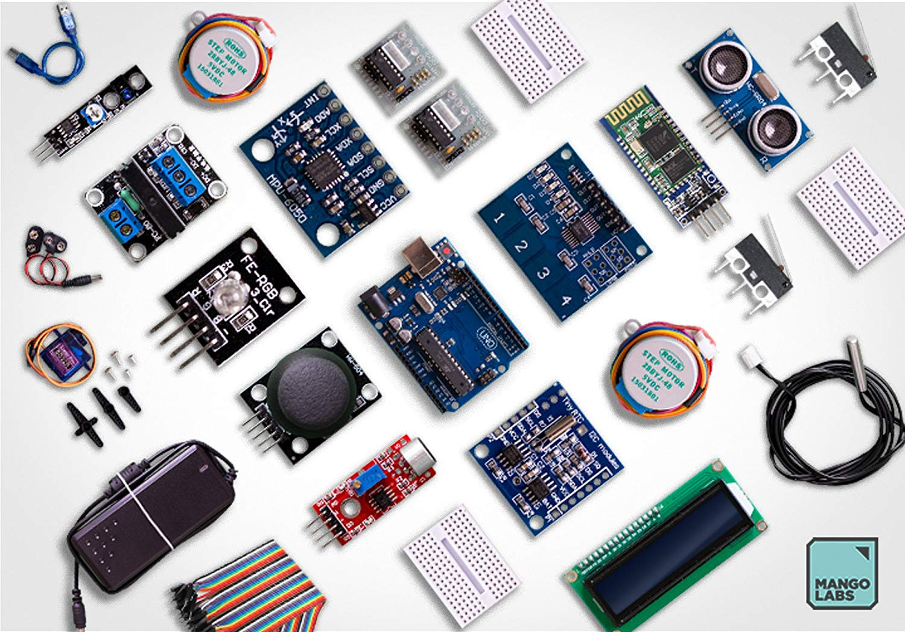
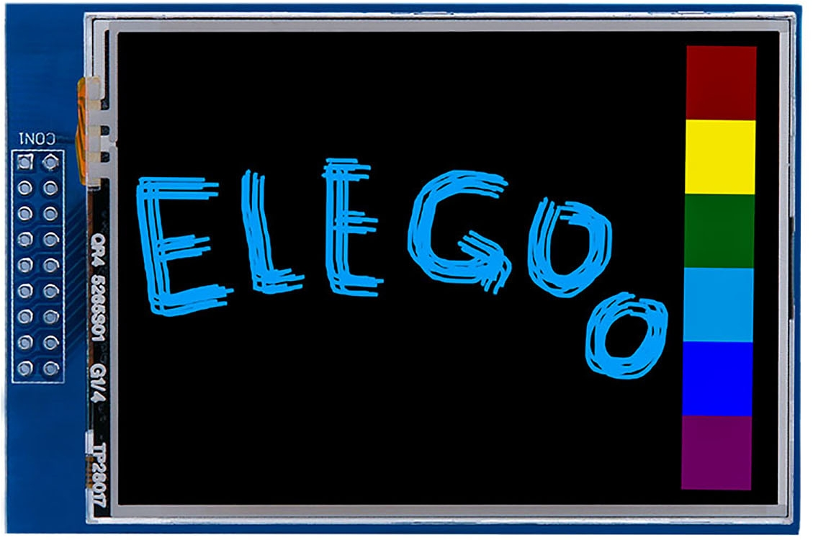
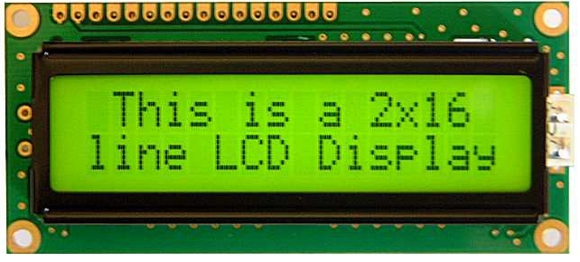
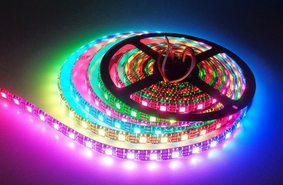
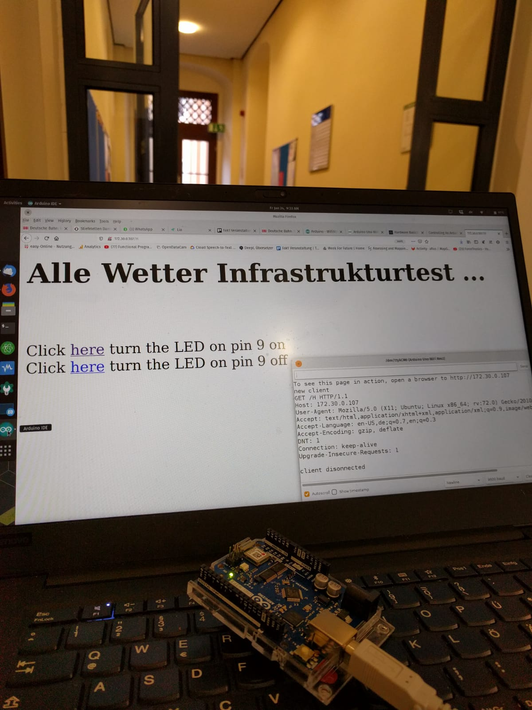
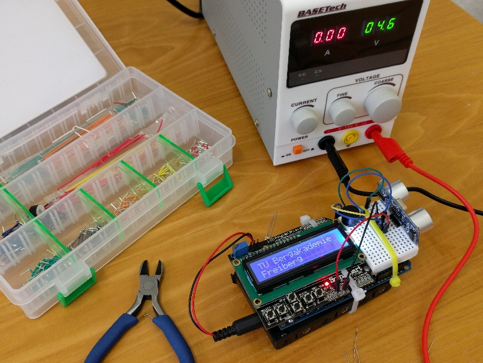

<!--

author:   Sebastian Zug & André Dietrich
email:    zug@ovgu.de   & andre.dietrich@ovgu.de
version:  1.0.1
language: de
narrator: Deutsch Female

@logo: <a href="https://www.hrk.de/weltoffene-hochschulen"></a>


link:     https://cdnjs.cloudflare.com/ajax/libs/animate.css/3.7.0/animate.min.css

import: https://raw.githubusercontent.com/LiaTemplates/Rextester/master/README.md
import: https://raw.githubusercontent.com/LiaTemplates/WebDev/master/README.md
import: https://raw.githubusercontent.com/LiaTemplates/NetSwarm-Simulator/master/README.md
-->

# Coding-Event an der TU Freiberg
@logo

<!-- width="80%" -->

 <font size="10">Herzlich willkommen!</font>

-------------------------------------------------------------------------------
Dieser Kurs wurde in LiaScript erstellt. Die interaktive Version finden Sie unter
[LiaLink](https://liascript.github.io/course/?https://raw.githubusercontent.com/SebastianZug/CodingEventFreiberg/master/Tutorial.md#1)

Sebastian Zug, TU Bergakademie Freiberg

## Motivation
@logo

                               {{0-1}}
********************************************************************************
> __Zielstellung__: Anwendungsorientiere Exploration der Möglichkeiten (und Grenzen) eingebetteter Systeme in einem interdisziplinären Team


> __Werkzeug__: Arduino ist eine aus Soft- und Hardware bestehende
> Physical-Computing-Plattform. Beide Komponenten sind im Sinne von Open
> Source quelloffen. Die Hardware besteht aus einem einfachen E/A-Board mit
> einem Mikrocontroller und analogen und digitalen Ein- und Ausgängen.


> __Wettbewerb__: Der Verein der Freunde und Förderer der Technischen Universität Bergakademie Freiberg [Link](https://tu-freiberg.de/wirtschaft/stiften-foerdern/freunde-foerderer) begleitet das Event und zeichnet den kreativsten Ansatz mit einem Preis aus. Freundlicherweise wurden dafür 4 Arduino Nano IoT bereitgestellt.

********************************************************************************


                               {{1-2}}
********************************************************************************

<!-- width="100%" -->
*Arduino Uno Rev 2 Wifi*

Jedes Arduinoprogramm umfasst 2 grundlegende Funktionen `setup()` und `loop()`.

```c   Blink.ino
const int ledPin = 25;   // Specific for UNO REV 2!
//const int ledPin = 13;

// the setup function runs once when you press reset or power the board
void setup() {
  // prepare serial communication
  Serial.begin(9600);
  // initialize digital pin ledPin as an output.
  pinMode(ledPin, OUTPUT);
  Serial.println("Initialization finished ... ");
}

// the loop function runs over and over again forever
void loop() {
  digitalWrite(ledPin, HIGH);   // turn the LED on (HIGH is the voltage level)
  Serial.print("An ... ");
  delay(1000);                  // wait for a second
  digitalWrite(ledPin, LOW);    // turn the LED off by making the voltage LOW
  Serial.println(" und Aus");
  delay(1000);                  // wait for a second
}
```

<!-- width="100%" -->
*Arduino IDE 1.8.x*

Wichtige Grundeinstellungen:

+ Aktivieren Sie den _verbose_ Modus  (File -> Preferences -> Verbose ...)
+ Richtigen Port für den Programmiervorgang auswählen (Tools -> Port)
+ Richtigen Controller auswählen (Tools -> Board)
+ Installation der notwendigen Bibliotheken (Manage Libraries -> )
+ Richtige Baudrate für die Serielle Schnittstellen (entsprechend der Einstellung im Programm)

********************************************************************************

## Informationsquellen
@logo

* Arduino Hardware beschreibung

     + Arduino Uno Wifi Rev 2 https://store.arduino.cc/arduino-uno-wifi-rev2

     + Arduino Uno Rev 3 https://store.arduino.cc/arduino-uno-rev3

* Referenzübersicht Arduino API

    + deutsch (unvollständig) https://www.arduino.cc/reference/de/

    + englisch https://www.arduino.cc/reference/en/

* Webseiten des Wiki des Herstellers mangolabs
       [https://www.mangolabs.de/wiki/](https://www.mangolabs.de/wiki/)

<!-- width="80%" -->

* Wir :-)

Zudem finden Sie im Netz eine Vielzahl von Projektbeschreibungen, die die
technische Realisierung auf Hard und Softwareebene beschreiben. Zum Beispiel zum Thema

+ LED Stripe [Link](https://www.heise.de/developer/artikel/Von-Erleuchtungen-und-Lichterketten-3277261.html)


## Verfügbare Materialien
@logo

1. __Mikrocontroller__

    + Arduino Uno Rev 3 (M)

    + Arduino Uno Rev 2 Wifi

2. __Sensoren__

    + Beschleunigungssensoren (boardintern und in M)

    + DHT11 (M) und DHT22

    + Bosch BME 680

    + Partikelfilter

    + Ultraschalldistanzsensoren, Mirkophone,  (M)

    + Wasserfeste Temperatursensoren (M)

3. __Aktoren__

    + grafikfähige Touch Displays (Treiberdownload unter https://www.elegoo.com/download/)

    + 2x16 LCD Displays (M)

    + Servomotoren (M)

    + Schrittmotoren (M)

    + Schallkapseln (M)

    + Mehrfarben LEDs (M), LED Strips


<!-- width="30%" -->
<!-- width="30%" -->
<!-- width="30%" -->

4. __Interaktion__

     + Taster, Touchpads, Joysticks (M)

     + Bluetooth Dongle


## Beispiele
@logo

An dieser Stelle werden einzelne Implementierungsvarianten vorgestellt, die für
Sie als Ausgangspunkt dienen können.

              {{0-1}}
********************************************************************************
__0. Wie wird das Wetter__

Seit Anfang Dezember zeichnen wir im Gebäude der Fakultät für Informatik das
Wetter mit mehreren Sensoren auf. Die Daten werden jede Minute erhoben und an
einen Server gesandt.

Folgende Sensoren sind im Einsatz:

+ Fotodiode über Spannungsteiler
+ DHT22 (Luftfeuchte und Temperatur)
+ Bosch BME 680 (Luftfeuchte, Temperatur, Luftdruck und Luftgüte)

Die Daten können unter [https://thingspeak.com/channels/856893](https://thingspeak.com/channels/856893) eingesehen werden und sind wie folgt strukturiert:

| Index | Benennung      |
| ----- | -------------- |
| 1     | TemperatureDHT |
| 2     | HumidityDHT    |
| 3     | Temperature680 |
| 4     | Humidity680    |
| 5     | Pressure       |
| 6     | Gas            |
| 7     | Light          |


> Achtung: Anders als richtige Programmiersprachen beginnt Matlab bei "1" zu zählen!

<iframe width="450" height="260" style="border: 1px solid #cccccc;" src="https://thingspeak.com/channels/856893/charts/7?bgcolor=%23ffffff&color=%23d62020&days=3&dynamic=true&type=line"></iframe>

Die bis heute Mittag aufgelaufenen Daten können unter diesem [Link](https://raw.githubusercontent.com/SebastianZug/CodingEventFreiberg/master/data/FreibergWetter.csv)
heruntergeladen werden.

Darüber hinaus stellt ThinkSpeak eine Matlab/JavaScript API bereit um, auf die Daten zurückzugreifen.  Das folgende Codeschnippsel illustriert die Anwendung und lädt 180 Datensätze in den Matlab-Workspace.

```matlab  ReceiveThinkspeakData.m
readChannelID = 856893;
fieldID1 = [1,3];
readAPIKey = '6XJTWTR4RS2STLE6';

[data, time] = thingSpeakRead(readChannelID, 'Field',
                              fieldID1, 'NumPoints', 180,
                              'ReadKey', readAPIKey);

plot(time, data);
legend(["Temperatur DHT","Temperatur Bosch 680"])
ylabel("Temperatur")
```

Weitere Beispiele finden Sie unter [Link](https://de.mathworks.com/help/thingspeak/thingspeakread.html).

********************************************************************************

              {{1-2}}
********************************************************************************

__1. Füttern einer Cloud mit lokalen Daten__

Umgekehrt können Sie natürlich auch eigene Daten in einer Cloudlösung ablegen.
Nachfolgend wird der Code vorgestellt, der für die Generierung der Daten aus Beispiel 0 genutzt wurde.

<!--
style="width: 80%; min-width: 420px; max-width: 720px;"
-->
```ascii
                                           .-,(  ),-. Cloud
    +----------+    +------------+      .-(          )-.      +---------+
--->| Sensoren |--->| Mikro-     |---> (   ThinkSpeak   ) <-- | Client  |
    | 1 - n    |    | controller |      '-(         ).-'      +---------+
    +----------+    +------------+         '-.( ).-'

```     

```cpp  ThinkSpeak.ino
#include <WiFi101.h>
#include "secrets.h"
#include "ThingSpeak.h"
#include "DHT.h"
#include "Zanshin_BME680.h"

///////please enter your sensitive data in the Secret tab/secrets.h
char ssid[] = SECRET_SSID;   // your network SSID (name)
char pass[] = SECRET_PASS;   // your network password

int status = WL_IDLE_STATUS;

// Initialize the Wifi client library
WiFiClient client;

// ThingSpeak Settings
unsigned long myChannelNumber = SECRET_CH_ID;
const char * myWriteAPIKey = SECRET_WRITE_APIKEY;
long count = 0;

#define DHTTYPE DHT22
const int pinDHT22 = A0;
DHT dht22(pinDHT22, DHTTYPE);

BME680_Class BME680;

void setup() {
  Serial.begin(9600);
  Serial.println("Freiberg Coding Event - Data logger");
  // attempt to connect to Wifi network

  if (WiFi.status() == WL_NO_SHIELD) {
    Serial.println("Communication with WiFi module failed!");
    // don't continue
    while (true);
  }

  Serial.print(F("- Starting Thing Speak client\n"));
  ThingSpeak.begin(client);  //Initialize ThingSpeak

  Serial.print(F("- Initializing BME680 sensor\n"));
  while (!BME680.begin(I2C_STANDARD_MODE)) // Start BME680 using I2C protocol
  {
    Serial.println(F("-  Unable to find BME680. Waiting 3 seconds."));
    delay(3000);
  } // of loop until device is located
  BME680.setOversampling(TemperatureSensor,Oversample16); // Use enumerated type values
  BME680.setOversampling(HumiditySensor,   Oversample16);
  BME680.setOversampling(PressureSensor,   Oversample16);
  BME680.setIIRFilter(IIR4);
  BME680.setGas(320,150);

  Serial.print(F("- Initializing DHT22 sensor\n"));
  dht22.begin();

  Serial.print(F("Initializing finished\n"));
}

void loop() {
  // Connect or reconnect to WiFi
  Serial.println("");
  Serial.print("Attempting to connect to SSID ... ");
  while(WiFi.status() != WL_CONNECTED){
      WiFi.begin(ssid, pass); // Connect to WPA/WPA2 network. Change this line if using open or WEP network
       delay(5000);     
  }
  Serial.println("\nConnected.");

  float temperatureDHT = dht22.readTemperature();
  float humidityDHT = dht22.readHumidity();

  static int32_t temperature680, humidity680, pressure, gas;
  BME680.getSensorData(temperature680, humidity680, pressure,gas);

  int light = analogRead(A5);

  Serial.print( "T_DHT = " );
  Serial.print( temperatureDHT, 1 );
  Serial.print( " T_680 = " );
  Serial.print(temperature680/100.0,2);
  Serial.print( " HUM_DHT = " );
  Serial.print( humidityDHT, 1 );
  Serial.print( "% HUM_680 = " );
  Serial.print(humidity680/1000.0,2);
  Serial.print( " Pressure = " );
  Serial.print(pressure/100.0,2);  
  Serial.print( " Gas = ");                       
  Serial.print(gas/100.0,2);
  Serial.print(F("mOhm"));
  Serial.print( " Light = ");                       
  Serial.println(light);

  // set the fields with the values
  ThingSpeak.setField(1, (float) temperatureDHT);
  ThingSpeak.setField(2, (float) humidityDHT);
  ThingSpeak.setField(3, (float)(temperature680/100.0));
  ThingSpeak.setField(4, (float)(humidity680/1000.0));
  ThingSpeak.setField(5, (float)(pressure/100.0));
  ThingSpeak.setField(6, (float)(gas/100.0));
  ThingSpeak.setField(7, (int)   light);
  ThingSpeak.setStatus("ok");

  // write to the ThingSpeak channel
  int x = ThingSpeak.writeFields(myChannelNumber, myWriteAPIKey);
  if(x == 200){
    Serial.println("Channel update successful.");
  }
  else{
    Serial.println("Problem updating channel. HTTP error code " + String(x));
  }
  delay(60000); // Wait 60 seconds to update the channel again
  WiFi.end();
}
```

********************************************************************************

              {{2-3}}
********************************************************************************

__2. Webserver für die Steuerung des Arduino__

Lassen Sie auf dem Arduino einen Webserver laufen, der wiederum einen Zugriff auf
verschiedene Aktoren bietet. Im einfachsten Fall sind das die LEDs, möglicherweise
aber ein Servomotor oder ein Display.

<!-- width="50%" -->
*Fernsteuerung des Arduino*

```cpp
#include <SPI.h>
#include <WiFiNINA.h>

#include "secrets.h"
///////please enter your sensitive data in the Secret tab/secrets.h
char ssid[] = SECRET_SSID;   // your network SSID (name)
char pass[] = SECRET_PASS;   // your network password

int keyIndex = 0;                 // your network key Index number (needed only for WEP)

int status = WL_IDLE_STATUS;
WiFiServer server(80);

void setup() {
  Serial.begin(9600);      // initialize serial communication
  pinMode(9, OUTPUT);      // set the LED pin mode

  // check for the WiFi module:
  if (WiFi.status() == WL_NO_MODULE) {
    Serial.println("Communication with WiFi module failed!");
    // don't continue
    while (true);
  }

  String fv = WiFi.firmwareVersion();
  if (fv < WIFI_FIRMWARE_LATEST_VERSION) {
    Serial.println("Please upgrade the firmware");
  }

  // attempt to connect to Wifi network:
  while (status != WL_CONNECTED) {
    Serial.print("Attempting to connect to Network named: ");
    Serial.println(ssid);                   // print the network name (SSID);

    // Connect to WPA/WPA2 network. Change this line if using open or WEP network:
    status = WiFi.begin(ssid, pass);
    // wait 10 seconds for connection:
    delay(10000);
  }
  server.begin();                           // start the web server on port 80
  printWifiStatus();                        // you're connected now, so print out the status
}


void loop() {
  WiFiClient client = server.available();   // listen for incoming clients

  if (client) {                             // if you get a client,
    Serial.println("new client");           // print a message out the serial port
    String currentLine = "";                // make a String to hold incoming data from the client
    while (client.connected()) {            // loop while the client's connected
      if (client.available()) {             // if there's bytes to read from the client,
        char c = client.read();             // read a byte, then
        Serial.write(c);                    // print it out the serial monitor
        if (c == '\n') {                    // if the byte is a newline character

          // if the current line is blank, you got two newline characters in a row.
          // that's the end of the client HTTP request, so send a response:
          if (currentLine.length() == 0) {
            // HTTP headers always start with a response code (e.g. HTTP/1.1 200 OK)
            // and a content-type so the client knows what's coming, then a blank line:
            client.println("HTTP/1.1 200 OK");
            client.println("Content-type:text/html");
            client.println();

            // the content of the HTTP response follows the header:
            client.print("<H1>Alle Wetter Infrastrukturtest ...</H1>");
            client.print("<br> <br> Click <a href=\"/H\">here</a> turn the LED on pin 9 on<br>");
            client.print("Click <a href=\"/L\">here</a> turn the LED on pin 9 off<br>");

            // The HTTP response ends with another blank line:
            client.println();
            // break out of the while loop:
            break;
          } else {    // if you got a newline, then clear currentLine:
            currentLine = "";
          }
        } else if (c != '\r') {  // if you got anything else but a carriage return character,
          currentLine += c;      // add it to the end of the currentLine
        }

        // Check to see if the client request was "GET /H" or "GET /L":
        if (currentLine.endsWith("GET /H")) {
          digitalWrite(9, HIGH);               // GET /H turns the LED on
        }
        if (currentLine.endsWith("GET /L")) {
          digitalWrite(9, LOW);                // GET /L turns the LED off
        }
      }
    }
    // close the connection:
    client.stop();
    Serial.println("client disonnected");
  }
}

void printWifiStatus() {
  // print the SSID of the network you're attached to:
  Serial.print("SSID: ");
  Serial.println(WiFi.SSID());

  // print your board's IP address:
  IPAddress ip = WiFi.localIP();
  Serial.print("IP Address: ");
  Serial.println(ip);

  // print the received signal strength:
  long rssi = WiFi.RSSI();
  Serial.print("signal strength (RSSI):");
  Serial.print(rssi);
  Serial.println(" dBm");
  // print where to go in a browser:
  Serial.print("To see this page in action, open a browser to http://");
  Serial.println(ip);
}
```

********************************************************************************

## Ideen
@logo

1. Spiele implementierung mit dem internen Beschleunigungssensor des Arduino Uno Rev. 2 und einem Display.

2. Steuerung des Displays, der Sensoren mittels des Mobil-Telefons über einen Webserver auf dem Arduino.

3. Intelligenter Wecker, der die Fahrtzeit zur Uni in Abhänigkeit vom Wetter bestimmt und eine adaptive Weckzeit festlegt.

> Noch ein Wort zum Teamplay! Sie arbeiten heute in interdisziplinären Gruppen mit einem unterschiedlichen Kompentenzen. Berücksichtigen Sie dies bei der Kommunikation und Diskussion!

<!-- width="80%" -->

 <font size="10">Los geht`s, Viel Spaß!</font>
